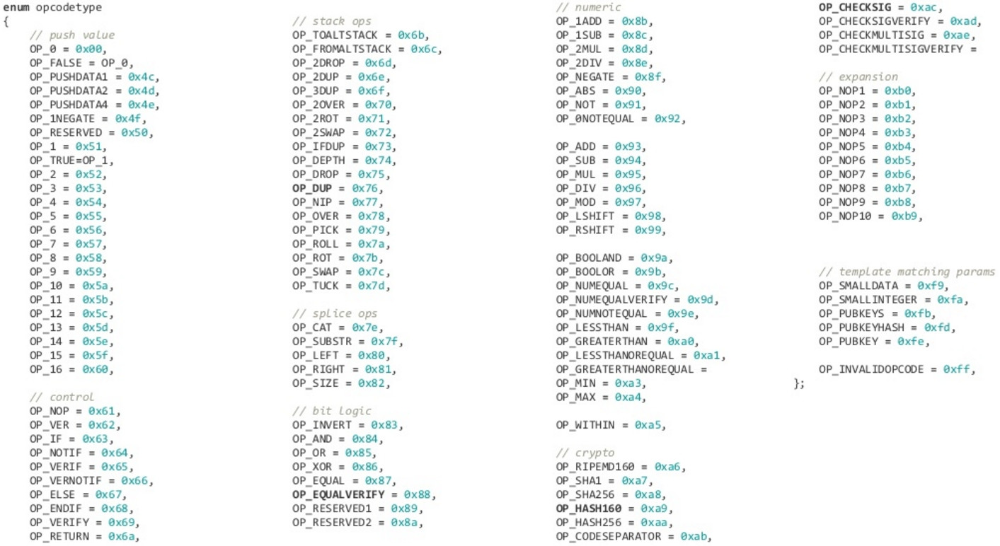

# Programming Theory

Bütün proqramlaşdırma dilləri ümumi  ya "compiled" (Azərbaycan dilində hərfi tərcümə: tərtib edilmiş Türk dilində: derlenmiş) yada "interpreted" (Azərbaycan dilində hərfi tərcümə: təfsir edilmir Türk dilində: yorumlanmış) olmaqla 2 kateqoriyaya ayrılır.&#x20;

Compiled proqramlaşdırma dillərində, kod icra edilməmişdən əvvəl (before execute) mütləq ikilik (binary) kodlara çevrilməlidir. Yəni yazdığımız kod icra edilən zaman, kompilyator tərəfindən maşın dilinə tərcümə edilir. Tərcümə prosesi bitdikdən sonra kodumuz icra üçün (run) hazır vəziyyətə gətirilir. Bu proses kodun icrasında əlavə mərhələ kimi olsa da, prosesin sonunda yaradılan binar kod performans cəhətdən daha tənzimlənmiş və sürətli olması deməkdir. Bu dillərə nümunə olaraq: C, C++, Rust&#x20;

İnterpreter proqramlaşdırma dillərində, kod icra edilən zaman, sətir-sətir oxunaraq icra edilir. Bu zaman kod sətir-sətir oxunduqda binar kodlara tərcümə edilir və hər sətir ardıcılıq olaraq icra olunur. Sətirlərin tək-tək tərcümə edilərək icra prosesində bu tip dillər zaman cəhətindən daha ləng  hesab olunur. Bu dillərə nümunə olaraq: Python, JavaScript, Ruby.

Eyni zamanda biz sahədə "low-level programming" (Aşağı səviyyəli proqramlaşdırma dili) və "High-level programming" terminləri ilə rast gələ bilərik.

Low-level proqramlaşdırma dilləri insanlar tərəfindən oxunması və yazılması daha çətinvə hardware ilə daha yaxın dillər hesab olunur.&#x20;

High-level proqramlaşdırma dilləri insanlar tərəfindən oxunulması və yazılması daha rahat hesab edilir. Bu tip dillə low-level proqramlaşdırma dillərindən fərqli olaraq özündə daha çox funksiyalar cəmləşdirir və "Object-Oriented Programming" paradiqmasından istifadə edir.

Resources:


İnterpreter Proqramlaşdırma



Compiled Proqramlaşdırma


Təməldə CPU, compiled koddan qaynaqlanan opcode(operating codes)'lara dayanaraq hərəkət göstərir. Opcode CPU səviyyəsində idarə etmək üçün istifadə edilən funksiyalar və onların binary dəyərləridir. CPU-nun müəyyən bir hərəkətə uyğunlaşdırdığı binar dəyərdə deyilə bilər və bu funksiyalara Assembly proqramlaşdırma dilində rast gəlmək mümkündür. &#x20;

<figure><figcaption>
Opcodes və onların binary dəyərləri
</figcaption></figure>

Windows və ya Linux kompüterləri ilə məşğul olanda biz adətən x86 arxitekturası ilə maraqlanırıq. Arxitektura hansı opcode (əməliyyat kodları) etibarlı olduğunu və assembly'də hansı funksionallığa uyğun olduqlarını təyin edir. Eyni şey əksər smartfon və planşetlərdə istifadə olunan ARM kimi digər CPU arxitekturalarına da aiddir. Əməliyyat sistemi və ya brauzerin əsas komponentləri kimi aşağı yük və yüksək səmərəlilik tələb edən proqramlar adətən assembly'də yazılmış elementlərə malikdir. Penetration Tester kimi Assembly kodunu tez-tez yazmasaq da, təhlükəsizlik məhsullarından müxtəlif yan keçmə(bypass etmə) metodları və ya daha təkmil hücumlar həyata keçirmək üçün onu başa düşmək faydalı ola bilər. C kimi bir dili nəzərdən keçirdikdə, C hələ də nisbətən aşağı səviyyəli bir dil hesab edilsə də, daha çox insan tərəfindən oxuna bilən sintaksisdən istifadə edirik.
